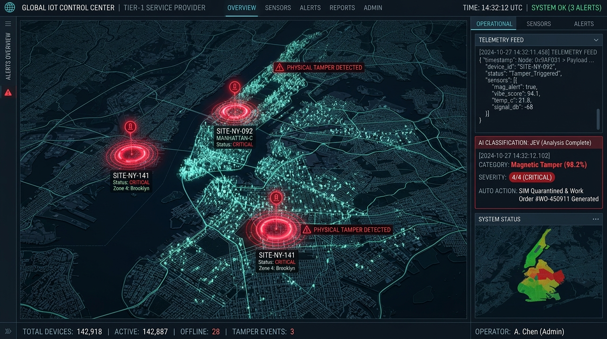

# Jev IoT Telemetry Fleet Manager
### Ultra-Low-Cost Mass IoT Anomaly Classification at Scale (10M+ Endpoints)

[](https://reactjs.org/)
[](https://www.typescriptlang.org/)
[](https://vitejs.dev/)
[](https://tailwindcss.com/)
[](LICENSE)

An end-to-end, carrier-grade edge AI telemetry classification and autonomic remediation dashboard designed for Tier-1 utility and telecom providers managing 10M+ smart utility meters (gas/water/electric).

Powered by **Jev**—a non-autoregressive, typed-primitive "System One" AI engine that slashes inference costs from ~$0.02/evaluation down to **~$0.042 per million input tokens** with zero generative token bloat and **sub-150ms parallel evaluation latency**.

---

<div align="center">
  
  <p><em>Provider Control Center: 2.5D Metro Grid Map with Real-Time Anomaly Strobe Beacons and Jev Reasoning Feed</em></p>
</div>

---

## ⚡ Quick Start: Downloading and Running Anywhere

Clone and run the complete application locally in under 60 seconds:

```bash
# 1. Clone the repository
git clone https://github.com/pjmenon45/Jev-IOT.git
cd Jev-IOT

# 2. Install dependencies (Node.js 18+ required)
npm install

# 3. Start the real-time development dashboard
npm run dev
```

Open your browser at:
👉 **[http://localhost:5173/](http://localhost:5173/)**

### 🧪 Run Automated Verification Tests
Validate the Layer 2 deterministic pre-filter, Layer 3 Jev typed-primitive contract, and Layer 4 remediation logic:
```bash
npm test
```

### 📦 Production Build
```bash
npm run build
npm run preview
```

---

## 💰 Economic Impact & Cost Efficiency

In a 10-million smart meter deployment, streaming raw telemetry to centralized cloud hyperscalers or running generative LLMs (e.g., standard autoregressive models) is cost-prohibitive ($200,000+ to $300,000+/month) and causes severe latency bottlenecks. Jev evaluates typed primitives with zero output token bloat at negligible expense:

| Metric | Standard Hyperscaler LLM (Generative) | Jev System-One Edge Architecture |
| :--- | :--- | :--- |
| **Model Architecture** | Autoregressive Generative LLM | Non-Autoregressive Typed Primitives |
| **Inference Latency** | 1,200ms – 2,500ms | **80ms – 140ms (~114ms avg)** |
| **Token Bloat** | High (~450 tokens/eval) | **Zero Bloat (~40 tokens compact schema)** |
| **Unit Cost** | ~$0.02 per evaluation | **$0.042 per million input tokens** |
| **Monthly Spend (10M fleet)** | **$214,500.00 / month** | **$32.71 / month** |
| **Annual Savings** | Baseline | **$2,573,600.00 / year (99.98% savings)** |

---

## 🏛️ End-to-End System Architecture

```
+---------------------------------------------------------------------------------------------------+
| LAYER 1: MASS IOT FIELD FLEET (10,000,000+ SMART METERS)                                          |
| 5 Metro Districts: Downtown, North Hills, Industrial Park, East Suburbs, South Basin              |
| Continuous 64-Byte Heartbeat Pulses (Battery, Delta/wk, Flow L/h, Reed, Tilt, RSSI, Retries)       |
+---------------------------------------------------------------------------------------------------+
                                ▼
+---------------------------------------------------------------------------------------------------+
| LAYER 2: PROVIDER EDGE GATEWAY & DISTRIBUTED USER PLANE                                           |
| • 92.4% Nominal Pulses (Delta = 0, Nominal Voltage, Clear Tamper Flags) -> Cached locally        |
| • 7.6% Anomalous, Borderline, or Cyclic Verification -> Dispatched to Layer 3                     |
+---------------------------------------------------------------------------------------------------+
                                ▼
+---------------------------------------------------------------------------------------------------+
| LAYER 3: JEV ULTRA-LOW-COST CLASSIFICATION ENGINE                                                 |
| High-Throughput / Non-Autoregressive Typed Primitives (Avg Latency: ~114ms | Cost: $0.042/M tokens)|
| Parallel Schema Execution:                                                                        |
|   • [ Choice Primitive ]  --> Issue: PHYSICAL_TAMPER | BATTERY_DECAY | RF_JAM | NOMINAL           |
|   • [ Score Primitive  ]  --> Severity: Tier 0 (Normal) to Tier 4 (Critical Hazard)               |
|   • [ Null / Prob      ]  --> Field Dispatch Warranted: Yes (0.94) / No (0.06)                     |
+---------------------------------------------------------------------------------------------------+
                                ▼
+---------------------------------------------------------------------------------------------------+
| LAYER 4: PROVIDER CONTROL CENTER & AUTOMATED REMEDIATION                                          |
| • ACTION A (Security): Automatic SIM Quarantine & Revenue Fraud Flagging                          |
| • ACTION B (Maintenance): Automated Truck-Roll Work Orders (#WO-89104) & Scheduled Batching       |
| • ACTION C (RF Optimization): Cellular Beam Steering & Local Interference Flagging                |
+---------------------------------------------------------------------------------------------------+
```

<div align="center">
  
  <p><em>Isometric System Infographic: Field Fleet to Edge Gateway, Jev Classifier Core, and Control Center</em></p>
</div>

---

## 🧩 Key Dashboard Capabilities

### 1. Interactive 2.5D Metro Grid Map ("Metro Austin")
- **High-Density Canvas Engine**: Renders 1,500+ animated micro-nodes representing the 10M endpoint fleet at 60 FPS without external map API keys.
- **Heterogeneous Realistic Distribution**: Critical (red strobe beacons) and major (amber battery decay & RF attenuation) anomalies are naturally distributed across all 5 metro districts:
  - **North Hills**: 2 Critical Tamper Beacons + 4 Battery Decays + 2 RF Jams
  - **East Suburbs**: 1 Critical Tamper Beacon + 8 Battery Decays + 2 RF Jams
  - **Downtown**: 1 Critical Tamper Beacon + 4 Battery Decays + 2 RF Jams
  - **Industrial Park**: 1 Critical Tamper Beacon + 4 Battery Decays + 4 RF Jams
  - **South Basin**: 1 Critical Tamper / Leak + 3 Battery Decays + 1 RF Jam
- **Multi-Tier Status Badges**: Dynamic indicators showing live counts simultaneously (e.g. `▲ North Hills [2 Crit] [4 Major]`).
- **Interactive Controls**: Click to inspect any endpoint, hover diagnostic tooltips, sector filters, and zoom controls.

### 2. Live Streaming Telemetry Feed
- Real-time pulse feed showing exact hierarchy matching carrier specs:
  - Raw Telemetry (`2.58V`, `HIGH_FLUX`, `TRIGGERED`, `-108dBm`, `Retries: 4`)
  - Jev Classification category & confidence score
  - Severity Score (Tier 0 to Tier 4)
  - Dispatch Probability with auto-approval status
  - Executed remediation action

### 3. Autonomic Remediation Bottom Dock
- **⚠️ Critical Tamper Review**: Review neodymium magnetic tampering, trigger instant SIM quarantine, or mark accounts for revenue fraud investigation.
- **📋 Auto-Dispatched Work Orders**: Track generated field technician tickets (`#WO-89104`), assigned personnel, ETA, and resolution lifecycle.
- **⚙️ Jev Decision Thresholds**: Live sliders to adjust dispatch probability thresholds, severity cutoffs, and edge pre-filter rates.
- **🧪 Test Bench Anomaly Injector**: Real-time simulation tool to inject random-sector Tampers, Battery Decay waves, RF Jamming, or Burst Leaks.
- **Architecture & Specs Modal**: Embedded high-resolution infographics and interactive JSON schema contracts.

---

## 📋 Data Schemas & Jev Contracts

### Raw Ingestion Pulse (Meter-to-Edge: 64-Byte Payload)
```json
{
  "device_id": "MTR-METRO-048291",
  "zone": "North Hills",
  "timestamp": "2026-09-22T14:26:00Z",
  "battery_volts": 2.58,
  "voltage_delta_per_week": -0.18,
  "flow_liters_per_hour": 0.0,
  "magnetic_reed_state": "HIGH_FLUX",
  "tilt_sensor_state": "TRIGGERED",
  "cellular_rssi_dbm": -108,
  "failed_tx_retries": 4
}
```

### Jev Query Contract (Zero Token Bloat Typed Primitives)
```json
{
  "state": "Device MTR-METRO-048291 in North Hills. Flow=0.0 L/h, Batt=2.58V (Drop=-0.18V/wk), Tilt=TRIGGERED, ReedSwitch=HIGH_FLUX, RSSI=-108dBm, Retries=4.",
  "primitives": {
    "classification": {
      "type": "choice",
      "options": [
        "NOMINAL",
        "MAGNETIC_OR_PHYSICAL_TAMPER",
        "BATTERY_ELECTROLYTE_DECAY",
        "RF_ATTENUATION_ANOMALY",
        "BURST_LEAK_ANOMALY"
      ]
    },
    "severity_tier": {
      "type": "score",
      "min": 0,
      "max": 4
    },
    "trigger_immediate_dispatch": {
      "type": "null",
      "question": "Does this event require physical field technician intervention within 24 hours?"
    }
  }
}
```

### Jev Structured Response Output
```json
{
  "latency_ms": 112,
  "classification": {
    "value": "MAGNETIC_OR_PHYSICAL_TAMPER",
    "confidence": 0.982
  },
  "severity_tier": {
    "value": 4,
    "confidence": 0.941
  },
  "trigger_immediate_dispatch": {
    "probability": 0.965
  }
}
```

---

## 📁 Project Directory Structure

```
Jev-IOT/
├── index.html                   # HTML entry point with carrier styling & fonts
├── package.json                 # Dependencies & scripts
├── vite.config.ts               # Vite configuration
├── tsconfig.json                # TypeScript compiler configuration
├── tailwind.config.js           # Tailwind dark-mode carrier theme
├── postcss.config.js            # PostCSS configuration
├── .gitignore                   # Ignored files & directories
├── public/
│   └── assets/                  # High-res architecture & UI infographics
│       ├── end_to_end_system_infographic.jpg
│       └── control_center_map_interface.jpg
├── scripts/
│   └── test-pipeline.js         # Automated end-to-end test suite
└── src/
    ├── main.tsx                 # React application bootstrapper
    ├── App.tsx                  # Core state machine & control center layout
    ├── index.css                # Global CSS & scanline styling
    ├── types/
    │   └── telemetry.ts         # Telemetry, Jev contracts & metrics types
    ├── services/
    │   ├── edgeFilter.ts        # Layer 2 deterministic pre-filter
    │   ├── jevClassifier.ts     # Layer 3 Jev typed primitive AI engine
    │   └── fleetSimulator.ts    # Layer 1 telemetry stream & remediation logic
    └── components/
        ├── HeaderMetricsBar.tsx # Top carrier bar & monospace metrics
        ├── MetroGridMap.tsx     # 2.5D Canvas map with strobe tamper beacons
        ├── LiveTelemetryStream.tsx # Real-time Jev inference feed
        ├── CostEfficiencyWidget.tsx # Hyperscaler vs Jev economics
        ├── BottomActionDock.tsx # Bottom carrier action dock
        └── Modals/
            ├── TamperReviewModal.tsx   # SIM quarantine & fraud review
            ├── WorkOrdersModal.tsx     # Technician ticket manager
            ├── ThresholdTunerModal.tsx # Jev decision sensitivity sliders
            ├── AnomalyInjectorModal.tsx# Test bench pulse injector
            └── ArchitectureModal.tsx   # Visual infographics & schema viewer
```

---

## 📄 License
This project is open-source and available under the [MIT License](LICENSE).
